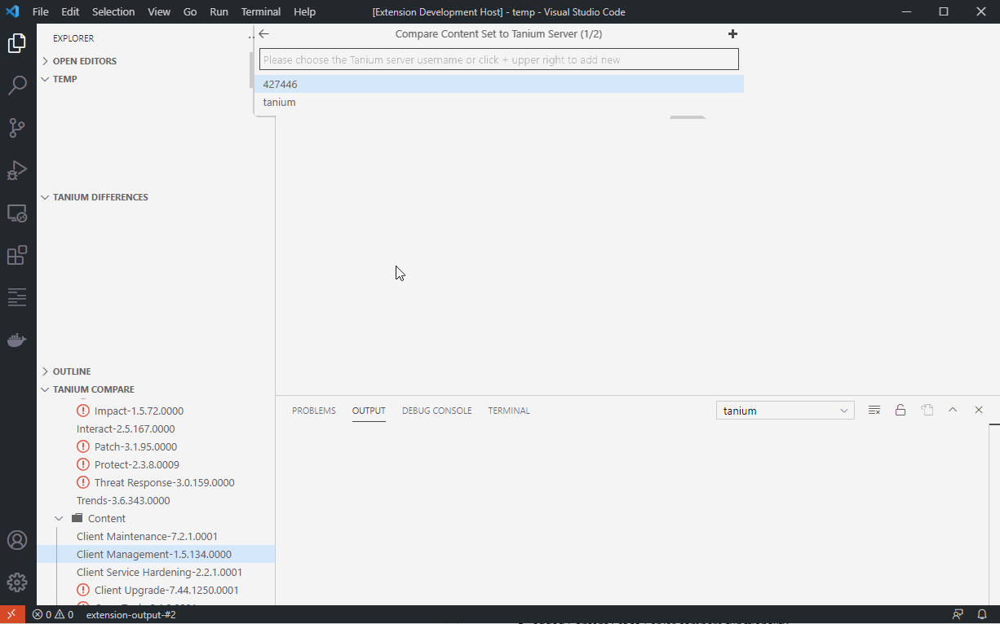

# HoganSlender's Tanium Tools

Contains miscellaneous commands to work with Tanium servers in Visual Studio Code.

- [HoganSlender's Tanium Tools](#hoganslenders-tanium-tools)
- [Configuration Settings](#configuration-settings)
  - [Fqdns and Usernames](#fqdns-and-usernames)
    - [**First time entry**](#first-time-entry)
    - [**Entries after first time**](#entries-after-first-time)
- [Features](#features)
  - [Content Set Compare](#content-set-compare)
    - [**Login**](#login)
    - [**Compare Content Set to Tanium Server Content**](#compare-content-set-to-tanium-server-content)
    - [**Server to Server Compare**](#server-to-server-compare)
    - [**Sign Content File**](#sign-content-file)
  - [Known Issues](#known-issues)
  - [Release Notes](#release-notes)
    - [1.0.0](#100)
    - [0.0.4](#004)
    - [0.0.3](#003)
    - [0.0.2](#002)
    - [0.0.1](#001)

# Configuration Settings
There are several configuration settings that control how the extension functions:

<table border=1>
  <thead>
    <tr>
      <th>Setting</th>
      <th>Description</th>
    </tr>
  </thead>
  <tbody>
    <tr>
      <td>Allow Self Signed Certs</td>
      <td>Set to true if communicating with servers that are using a self signed certificate.</td>
    </tr>
    <tr>
      <td>Fqdns</td>
      <td>List of recently used Tanium server FQDNs.</td>
    </tr>
    <tr>
      <td>Http Timeout Seconds</td>
      <td>Number of seconds for HTTP request timeout.</td>
    </tr>
    <tr>
      <td>Signing Paths</td>
      <td>Path definitions for KeyUtility.exe and private key file per Tanium Server</td>
    </tr>
    <tr>
      <td>Usernames</td>
      <td>List of recently used Tanium usernames.</td>
    </tr>
  </tbody>
</table>
 

## Fqdns and Usernames
As you enter Tanium Server FQDNs and Usernames, they are stored for later use.

### **First time entry**

### **Entries after first time**

Once the fqdn or username has been entered, they will show up in drop down list for selection. 

To enter a different fqdn or username, click the + symbol in the top right corner. 

To remove or change order, edit the settings.json.

# Features

## Content Set Compare
This functionality will show you any changes that exist between Tanium content and what exists in your Tanium server.

### **Login**

You first have to log into the target Tanium server to retrieve imported content sets and to compare to what is available. Click 'Compare Solutions' in the `TANIUM COMPARE` explorer window on left side to connect to Tanium server to do a comparison. Any content that has an update will be marked with an exclamation mark (!).

### **Compare Content Set to Tanium Server Content**
Once you have logged in, click the content set that you want to compare. The extension will will retrieve the content from Tanium and will pull the content from the targeted Tanium server.

Once content has been fully processed, differences will be listed under `TANIUM DIFFERENCES` explorer window by content type. The numbers in parentheses show type of difference by count:

(# new:# modified:# unchanged)

Double clicking an item in any list will up either the source for the file (new items) or pull up a diff window showing changes (modified or unchanged items).

### **Server to Server Compare**

### **Sign Content File**
## Known Issues
* none
## Release Notes
### 1.0.0 
* switched to new difference dialogs
* added Server to Server content compare functionality
* added Content Set to Server compare functionality
* removed `Tanium: Retrieve Sensor Data by Name` command
* removed `Tanium: Retrieve Sensor Data by Hash` command
* removed `Tanium: Generate Export File for Modified Sensors`
  
### 0.0.4
* Added `Tanium: Retrieve Sensor Data by Name` command
* Added `Tanium: Retrieve Sensor Data by Hash` command
* Added `Tanium: Generate Export File for Modified Sensors` command
* Adjusted progress indicators
### 0.0.3
* Removed `Tanium: Sign Content` and `Tanium: Generate Export File for Missing Sensors` from command palette since they are context menu driven
### 0.0.2
* Moved Release notes from README to CHANGELOG
### 0.0.1
* Release of `Tanium: Compare Content Set` command
* Release of `Tanium: Compare Tanium Server Sensors` command
* Release of `Tanium: Sign Content` context menu
* Release of `Tanium: Generate Export File for Missing Sensors` context menu
